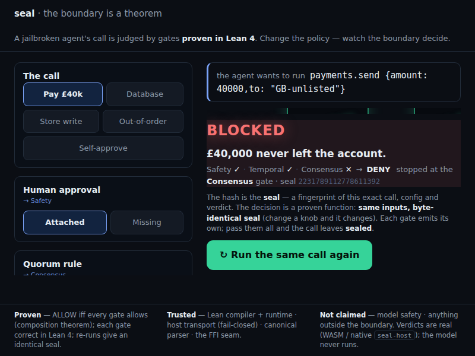

# seal-demo

[](https://github.com/velvetmonkey/seal-demo/actions/workflows/ci.yml)

**Watch the verified kernel decide live in your browser: a scripted attack gets BLOCKED, a benign one ALLOWED. Click once, see the real math.**



<sub>A jailbroken agent's `payments.send` for £40,000, judged gate by gate on the page. Safety and Temporal allow it; Consensus denies — the 2-of-3 quorum is missing — so the call never leaves. The `seal` is a fingerprint of that exact call, config and verdict: same inputs, byte-identical seal. The footer states the boundary in frame — what is proven, what is merely trusted, and what is not claimed at all.</sub>

No backend. The Lean-proven decision procedure runs in WASM. Every ALLOW/DENY and cert is computed on the page.

One command serves it and opens the browser. Click "Send the call" on the gauntlet — the kernel judges gate by gate.

> seal proves the *decision*, not the whole stack: for a canonical request and a
> policy, the verdict is what the theorem says, computed live by the verified
> kernel. It does not claim the proxy, auth, sandbox, or parser are unbypassable.
> See "The honest claim" below.

## Quick start (1-command showcase)

**One command:**

```sh
bash scripts/showcase.sh
```

One command serves the static kernel demo briefly and prints real page content (including "Proven — ALLOW iff...", "the decision is a proven function", verdict, kernel, trusted TCB notes). For the interactive gauntlet, serve the page persistently with `./demo.sh` (it prints the URL and keeps serving until Ctrl-C) and watch the WASM kernel decide live BLOCK/ALLOW. (`showcase.sh` is the non-interactive spot-check: it serves briefly, curls the page, and exits.)

(If no ./demo.sh: `cd public && python3 -m http.server 8080`, visit http://localhost:8080 — NOT file://.)

The kernel is the substance. The pre-scripted agent narrative just sets the stage.

No Python? Any static server works — from inside `public/`:

```sh
npx serve            # Node (npx serve -l 8080)
# or: php -S localhost:8080
# or: VS Code → "Live Server" extension → Go Live
```

That's the whole thing: every verdict is the real verified kernel deciding live in your browser, no backend required. For the native-binary target (Docker) and other run modes, see [Run it](#run-it) below.

## The honest claim

seal proves the **decision**, not the whole stack. The kernel guarantees: *for this canonical request and this policy, the verdict is DENY, by theorem X.* It does **not** claim the proxy, auth, sandbox, or parser are unbypassable. The demo shows the real guarantee with the Trusted Computing Base named on screen. Honesty is the pitch, not a footnote.

It also does **not** claim the compiled kernel provably equals the Lean model: `public/wasm/seal.wasm` is a *trusted compile* (Lean → C → emscripten) plus differential testing, **not** a proof (the T3 caveat). The in-browser sha256 proves *which binary ran*, never that it matches the model.

**Profile:** the deployed seal host mediates under the `compatible` profile, not strict canonical-l0 (see seal-host CLAIMS.md); the canonical AST is audit input to the kernels, not the mediation gate.

**Terminology:** this page writes **DENY** where the seal family's canonical verdict vocabulary is **BLOCK** — read DENY as BLOCK; the underlying verdict is identical.

## Trust boundaries

These are the four explicit places where Seal's proofs stop; each boundary is known and has a named closure path outside the kernel, closed or open as stated below. Canonical copy: [docs/LIMITATIONS.md](docs/LIMITATIONS.md); `scripts/claims-drift.mjs` fails the build if this mirror drifts.

<!-- trust-boundaries:begin -->
These are the four explicit places where Seal's proofs stop. They are strengths because the boundaries are known and each has a named closure path outside the kernel — closed where stated, still open where stated.

1. Byzantine / non-participating replica — non-bypass proven for replicas that RUN the gate; a replica not running seal is outside the TCB by definition. Named closure path (not yet implemented): attestation of the sealed core.
2. Egress after allow (P6) — seal mediates the DECISION and records it, not the downstream effect. Closes via: compose with an egress proxy; decision gate by design. (Already in seal-host's RUST_BRIDGE.md.)
3. Model vs compiled binary — proofs bind the routing core the code delegates to (Ffi.stepImpl → composed kernels), not a byte-for-byte proof of the compiled wasm. Lane C runs a wasm-vs-interpreted-Lean differential in seal-host CI over a fixed corpus; it is evidence over that corpus, not a universal binary-equals-model proof.
4. Partition liveness — safety (no double-spend) holds unconditionally under partition; liveness is conditional, inherited from crdt-lean. The correct safety-over-availability tradeoff.
<!-- trust-boundaries:end -->

## How it works — AI is filmed, the kernel decides live

A public demo must not run a live frontier model (cost, abuse, nondeterminism, and the night it refuses to misbehave on cue it dies on stage). So:

- **Attacks are pre-scripted offline** by a human, once (`fixtures/`). That's the agent's reasoning plus the exact tool call it attempts.
- **The kernel decides live, in your browser.** The verified `seal-host` kernel is compiled to WebAssembly (`public/wasm/seal.wasm`) and runs the real `seal_decide` entry point (`public/seal-wasm.js` calls it via `ccall`) — **no backend, no replay**. Every ALLOW/DENY and every cert hash on the page is computed live by the proven decision procedure, identically every run. The same kernel also runs natively behind `POST /api/decide` (Docker live mode); the two engines are held to byte-identical verdicts and certs by the conformance bridge upstream in `seal-host` (`scripts/conformance_bridge.mjs`) — this repo’s own CI checks copy-consistency only, it does not re-run that bridge.

The AI was always just the narrative wrapper. The kernel is the substance, and the substance is the AI-free part.

## The Gauntlet (`public/index.html`)

One guided page, one live stage. You watch a single tool call get **judged gate by gate**, instead of reading a verdict table. Each gate shows three registers ranked by size: a plain-English **stake** ("Could move money or wreck data, needs a human's say-so"), the real **rule** from the trusted config, and the dim **cert hash**, so a non-technical viewer and a formal-methods reviewer both read it at a glance.

Pick the call from the rail (a £40k payment, a destructive SQL drop, a replicated-store write, an out-of-order session replay, or a self-approve), then drive the bounded policy knobs:

1. **The gauntlet.** A jailbroken agent's call animates through the gating kernels in series; each gate stamps it ALLOW and passes it on, or slams it DENY and destroys it (the DENY leads with the counterfactual, "£40,000 never left the account"). Clear every gate and the call leaves as a sealed certificate. Hit **↻ Run the same call again** and the path repeats, the certificate locking to the **same hash every time**: proof that does not flicker.
2. **The policy knobs.** A handful of bounded controls (human approval, the 2-of-3 quorum rule, sign-offs 0 to 3, the store op, the call itself). Flip a knob and the verified kernel **re-decides live**; the affected gate flips ALLOW or DENY and a one-line causal readout carries the kernel's real reason. Scrub the sign-offs from 1 to 2 and the consensus gate flips DENY to ALLOW on the same call: real **verified quorum agreement** (majority check), not Paxos. Read the binding precisely: the deployed kernel's quorum ratifies the **tool name** ("`payments.send` may run"), not this call's argument bytes — the same 2-of-3 certificate would admit any other `payments.send` call; per-argument binding is proven (`byteConsensusKernel`) but is not yet the wired kernel.

Every verdict is **real**, computed live by the verified `seal-host` kernel compiled to WebAssembly (`public/wasm/seal.{js,wasm}`). `fixtures/captured.json` is regenerated through that shipped browser evaluator with `node scripts/regenerate-fixtures.cjs`.

## Run it

Two targets. Both decide live with the real verified kernel.

### Target A — in-browser WASM (no backend) — the default

The verified kernel compiled to WebAssembly decides entirely in the browser. No
server, no binary, no Rust/Lean/Mathlib. This is what `public/` serves; just host
the static files (the `.wasm` needs an HTTP origin — `file://` won't fetch it):

```sh
cd public && python3 -m http.server 8080      # then open http://localhost:8080/
```

The Gauntlet (`/`) computes real verdicts via `public/wasm/seal.{js,wasm}` at the
decision seam: pick a call from the rail, drive the policy knobs, and every verdict
is decided live in-browser, no backend.

### Target B — native binary behind /api/decide (Docker live)

The actual `seal-host` binary runs behind `POST /api/decide` for direct API-level
verification. The browser page itself decides via the in-browser WASM build of the
same kernel; byte-identity between the two is established by the upstream seal-host conformance bridge, not re-checked here. Bundles a locally
supplied native binary, so this image is **local only and is not part of this repository's release artifact**.

```sh
scripts/prepare-runtime.sh        # copies the seal-host binary into runtime/ (build it first)
docker compose up --build         # open http://localhost:8080/ ; POST /api/decide hits the native binary
```

Run it locally without Docker (point it at a built host):

```sh
SEAL_BIN=/path/to/seal-host/.lake/build/bin/seal-host \
SEAL_MOCK=/path/to/seal-host/test/integration/mock_mcp_server.py \
SEAL_PUBLIC=$PWD/public PORT=8080 python3 server/decide_server.py
```

### Rebuilding the WASM evaluator

`public/wasm/seal.{js,wasm}` is the compiled black-box evaluator — built from the
public `seal-host` repo, never from source here. To regenerate (from a clean
`seal-host` checkout): see `seal-host/wasm-spike/RESUME.md` — `build_closure.sh`
then `build_wasm.sh` produce `build-core/seal.{js,wasm}`; copy them into
`public/wasm/`. Regenerate the demo's verdict fixtures through the copied browser
artifact with `node scripts/regenerate-fixtures.cjs`; `--check` fails if committed
fixtures drift. The broader kernel differential remains in `seal-host/wasm-spike/`.

The heavy dependencies (Rust + Lean + Mathlib) belong only to *building* the
verified host, never to running either target. See `docs/BUILD.md`.

## Delivery spectrum

One kernel artifact — a trusted compile of the proven decision procedure (the T3 caveat above) — four modes (same WASM core):

- **browser** — this demo
- **embedded** — the licensed PDP component, dropped into the host process (lowest latency, no phone-home)
- **edge** — Cloudflare / Fastly / Vercel (all run WASM), sub-ms verdicts on the agent's hot path, no central chokepoint
- **native** — full production server

## Publication boundary

This repository is public. It ships the compiled evaluator and demo shell; the kernel and host
sources remain in their own public repositories and are not duplicated here.

## Status

**v2 complete — live verdicts on both targets:**
- **WASM in-browser** (`public/`, `public/wasm/seal.{js,wasm}`): the Gauntlet computes real verdicts from the verified kernel, in the browser, no backend. The re-run lock proves determinism live.
- **Native** (`Dockerfile.live`, `server/decide_server.py`): the real `seal-host` binary decides behind `/api/decide`, byte-identical to the WASM build per the upstream seal-host conformance bridge.
- **Fixture-gated:** `scripts/regenerate-fixtures.cjs --check` re-decides every published scenario through the shipped WASM kernel (`public/wasm/seal.wasm`, sha256 `28bb3ae71985…`) and checks the attack stays DENY while benign cases stay ALLOW.

The Lean → C → emscripten WASM port lives in the public `seal-host` repo (`wasm-spike/`); this demo release packages its tracked compiled `.wasm`/`.js` and shell, not the host source tree.
